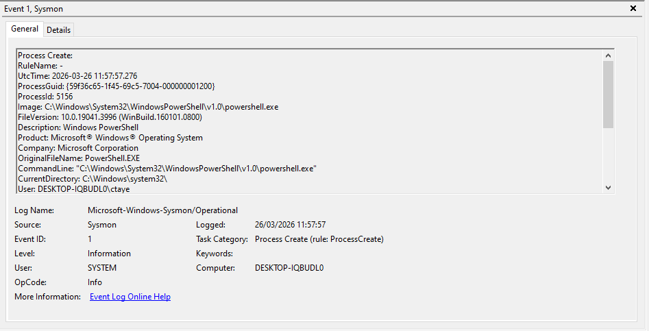
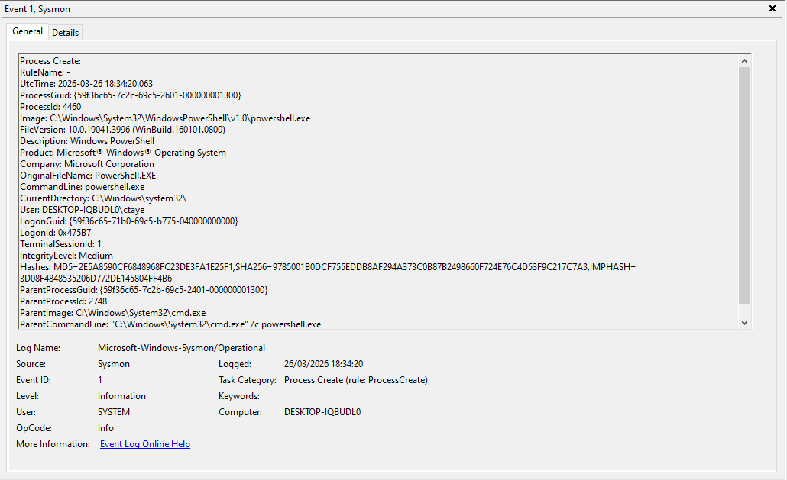
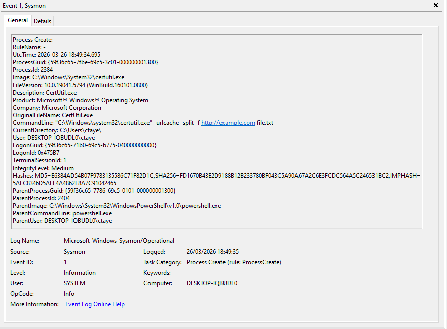

# Detection Validation

## MITRE ATT&CK Coverage

This project demonstrates detection and validation of behaviours aligned to the following MITRE ATT&CK techniques:

- T1059.001 — Command and Scripting Interpreter: PowerShell  
- T1059 — Command and Scripting Interpreter  
- T1105 — Ingress Tool Transfer  

These techniques represent common execution and command-and-control behaviours observed in real-world attacks.

---

## Objective

The objective of this phase is to validate that simulated attacker behaviours were successfully detected, captured, and contextualised using endpoint telemetry.

This confirms that the detection pipeline is functioning correctly and producing meaningful signals for analysis.

---

## Validation Scope

The following behaviours were validated:

1. PowerShell execution  
2. Suspicious process chain (cmd.exe → powershell.exe)  
3. certutil usage (Living Off the Land behaviour)  

---

## Validation 1: PowerShell Execution

### Test Description

PowerShell was executed using a command to simulate scripted or command-based activity.

### Command Executed

```powershell
powershell.exe -Command "Get-Process"
```

### Observed Outcome

- Sysmon generated Event ID 1  
- Process creation recorded for `powershell.exe`  
- Command-line arguments visible in event data  

### Evidence

[](../assets/screenshots/powershell-execution.png)

### MITRE ATT&CK Mapping

- Tactic: Execution  
- Technique: Command and Scripting Interpreter: PowerShell (T1059.001)  

### Detection Tags

- Execution  
- PowerShell  
- Endpoint Telemetry  
- Sysmon Event ID 1  

### Analysis

PowerShell execution is common in both legitimate administration and malicious activity. In isolation, this behaviour is low fidelity, but it becomes more significant when combined with unusual command-line arguments or suspicious context.

---

## Validation 2: Suspicious Process Chain

### Test Description

A command shell was used to launch PowerShell, creating a parent-child process relationship.

### Command Executed

```powershell
cmd.exe /c powershell.exe
```

### Observed Outcome

- Sysmon generated Event ID 1  
- Child process: `powershell.exe`  
- Parent process: `cmd.exe`  
- Parent-child relationship visible in event data  

### Evidence

[](../assets/screenshots/process-chain.png)

### MITRE ATT&CK Mapping

- Tactic: Execution  
- Technique: Command and Scripting Interpreter (T1059)  

### Detection Tags

- Execution  
- Process Relationship  
- Parent-Child Behaviour  
- Behavioural Detection  

### Analysis

Process chains provide valuable context. While this behaviour can be legitimate, it becomes more suspicious when repeated, automated, or observed in unusual environments.

---

## Validation 3: certutil Usage

### Test Description

certutil was executed to simulate Living Off the Land behaviour commonly used for file transfer.

### Command Executed

```powershell
certutil.exe -urlcache -split -f http://example.com file.txt
```

### Observed Outcome

- Sysmon generated Event ID 1  
- Process creation recorded for `certutil.exe`  
- Command-line arguments include URL and file retrieval  

### Evidence

[](../assets/screenshots/certutil-activity.png)

### MITRE ATT&CK Mapping

- Tactic: Command and Control  
- Technique: Ingress Tool Transfer (T1105)  

### Detection Tags

- Command and Control  
- Living Off the Land  
- LOLBins  
- File Transfer Behaviour  

### Analysis

certutil is a legitimate system utility, but its use with external URLs is commonly associated with attacker behaviour. This makes it a valuable detection opportunity when used outside expected administrative context.

---

## End-to-End Validation

The following detection flow was confirmed:

Simulated behaviour → Sysmon Event ID 1 → Wazuh ingestion → Analyst visibility

This demonstrates that endpoint telemetry is successfully captured and centralised.

---

## Detection Classification

The validated behaviours fall into the following detection categories:

- Low Fidelity: Single PowerShell execution  
- Medium Fidelity: Process chaining behaviour  
- High Value Indicator: certutil usage with external URL  

This classification reflects how a SOC analyst would prioritise and triage alerts based on context and behaviour.

---

## SOC Perspective

From a SOC analyst perspective, these detections represent early-stage attacker behaviour.

While each event individually may be low severity, their value increases when:

- observed together  
- repeated over time  
- associated with unusual users or systems  

This highlights the importance of correlation and context in detection engineering.

---

## Conclusion

The lab environment successfully demonstrates a functioning detection pipeline based on endpoint telemetry.

- PowerShell activity was captured and analysed  
- Process chaining behaviour was identified  
- certutil usage was detected and contextualised  

This confirms that the environment supports detection, analysis, and validation of realistic attacker techniques.

The project demonstrates readiness for further detection engineering and more advanced attack simulation scenarios, building on a validated and operational detection pipeline.
